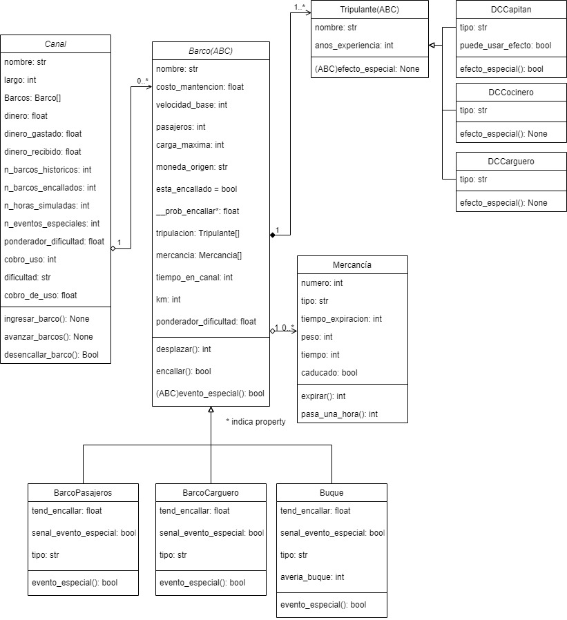

# Tarea 1: DCCanal :school_satchel:

  

## Consideraciones generales :octocat:
***
Ninguna

  

***

## Diagrama de clases
<p align="center">
        
    </a>
</p>


  

### Cosas implementadas y no implementadas :white_check_mark: :x:

  

No se revisará cada subítem, pero cada uno está leído y funciona como indica la pauta, en algunos se especifican comentarios.

* <Programación  orientada  a  objetos<sub>1</sub>>: Hecha completa

*  * <Diagrama<sub>1.1</sub>>: Hecha completa
* * <Definición de clases, atributos y métodos<sub>1.2</sub>>: Hecha completa
* * <Relaciones entre clases, atributos y métodos<sub>1.3</sub>>: Hecha completa


* <Simulaciones<sub>2</sub>>: Hecha completa
* * <Se  pueden  crear  una  o  más  simulaciones  del  DCCanal<sub>2.1</sub>>: Comentario: No se pueden hacer simulaciones simultáneas, dicho de otra manera, la simulación acaba cuando vuelvo al menú de inicio) o se selecciona la opción de salir de la misma


* <Acciones<sub>3</sub>>: Hecha completa

*  * <Barcos<sub>3.1</sub>>: Hecha completa

*  * <Tripulación<sub>3.2</sub>>: Hecha completa

* * <Mercancía<sub>3.3</sub>>: Hecha completa

* * <Canales<sub>3.3</sub>>: Hecha completa

* <Consola<sub>3</sub>>: Hecha completa
*  * <Menú inicio<sub>3.1</sub>>: Hecha completa
*  * <Menú acciones<sub>3.2</sub>>: Hecha completa
*  * <Simular hora<sub>3.3</sub>>: Hecha completa
*  * <Mostrar estado<sub>3.4</sub>>: Hecha completa
* *  * <Mostrar estado<sub>3.4.1</sub>>: Consideración: Regresa automáticamente al menú de acciones 
*  * <Robustez<sub>3.5</sub>>: Hecha completa


* <Manejo de archivos<sub>4</sub>>: Hecha completa
* * <Archivos csv<sub>4</sub>>: Hecha completa
* * <parametros.py<sub>4</sub>>: Hecha completa
* * <Manejo de archivos<sub>4</sub>>: Hecha completa


## Ejecución :computer:

  

El módulo principal de la tarea a ejecutar es ```main.py```. Además se debe crear los siguientes archivos y directorios adicionales:

  

1.  ```barcos.py``` en ```T1```

  

2.  ```canales.py``` en ```T1```

3.  ```funciones_utiles.py``` en ```T1```

4.  ```manejo_de_archivos.py``` en ```T1```

5.  ```menus.py``` en ```T1```

6.  ```mercancia.py``` en ```T1```

7.  ```parametros.py``` en ```T1```

8.  ```simular_hora.py``` en ```T1```

9.  ```tripulacion.py``` en ```T1```

10.  ```barcos.csv``` en ```T1```

11.  ```canales.csv``` en ```T1```

12.  ```mercancia.csv``` en ```T1```

13.  ```tripulantes.csv``` en ```T1```

***

  

## Flujo del programa :cyclone:

Qué hace cada parte del programa está indicado con comentarios en el código, pero acá se da el flujo de este de forma de poder hacer un tracking general de dónde ocurre cada cosa. Me das el feedback de si es bueno dejarlo aquí o sólo indicarlo en el código porfa :smile:

  

-El éxito dado una probabilidad se calcula con la función ocurre_evento_por_probabilidad() de funciones_utiles.py

-Los archivos se cargan en diccionarios dados por las funciones de manejo_de_archivos.py

1.  **Main.py**: Hace un print para iniciar el programa y llama a ```menu_de_inicio```

2.  **Menú de inicio**: Da la opción de ingresar al ```menu_de_acciones``` o salir del programa

3.  **Menú de acciones**: Da la opción de salir del programa, volver al menú de inicio o realizar una de las acciones que se detallan a continuación

3.1 **acc_mostrar_proba()**: Muestra la probabilidad de que encalle cada barco que está en el canal

3.2 **acc_desencallar()**: Intenta desencallar al barco si hay dinero, por medio del método ```desencallar_barco()``` de la clase Canal, mediante probabilidades

3.3 **acc_mostrar_estado()**: Printea distintos atributos de canal que dan información acerca del estado del mismo. Además imprime los barcos y sus posiciones

3.4 **simular_hora.py**: La última acción (```acc_simular_hora()```) se guarda en un archivo aparte, dada su complejidad. Realiza partes de la simulación y deriva otras en el método ```ingresar_barco()``` y ```avanzar_barcos()``` de canal. También puede volver a menú de acciones

3.4.1 **Canal.ingresar_barco**: Ingresa un barco al canal, dejándolo listo para que avance por el canal

3.4.2 **Canal.avanzar_barcos**: Hace avanzar a los barcos que están por delante del último barco encallado, descubriendo su desplazamiento con el método ```desplazar()``` de Barco. Verifica el evento especial de Buque e imprime la situación posicional del barco. Finalmente gestiona los pagos de acuerdo a la situación del barco, aquí verifica el evento especial de BarcoCarguero. PD: Los costos de mantención los calcula con ``` CurrencyConverter()```

3.4.2.1 **Barco.desplazar()**: Cobra multas por mercancía vencida y revisa si encalla, tomando en cuenta la posibilidad de usar el efecto especial del capitán. Llama al método ```evento_especial()``` de Barco y calcula el desplazamiento.

3.4.2.1.1 **Barco.evento_especial()**: Calcula con probabilidades si ocurre el evento especial. Si lo hacer, modifica las variables que debe modificar el evento especial dependiendo de cada barco, y da una señal de que ya se usó

  
  
  

## Librerías :books:

  

### Librerías externas utilizadas

  

La lista de librerías externas que utilicé fue la siguiente:

  

  

1.  ```random```: ```randint()```

  

2.  ```currency_converter```: ```convert() / CurrencyConverter``` (debe instalarse)

  

3.  ```abc```: ```ABC, abstractmethod```

  

  

### Librerías propias

  

Por otro lado, los módulos que fueron creados fueron los siguientes:

  

  

1.  ```barcos```: Contiene a ```Barco``` y sus subclases

  

2.  ```canales```: Contiene a ```Canal```

3.  ```mercancia```: Contiene a ```Mercancia```

4.  ```tripulación```: Contiene a ```Tripulante``` y sus subclases

  

5.  ```funciones_utiles```: Contiene a las funciones ```ordenar_por_km()``` y ```ocurre_evento_por_probabilidad()```

6.  ```manejos_de_archivos```: Funciones que abren todos los archivos necesarios y los retornan en diccionarios

7.  ```menus```: Tiene funciones con los menús ```menu_de_inicio()``` y ```menu_de_acciones()```. Además alberga las funciones acciones de este último menú, que se denotan con acc. Se modulariza en otra librería la acción "simular hora", dado que requería una complejidad y extensión mayor

8.  ```simular_hora```: Contiene ```acc_simular_hora()```, última acción del menú de acciones, y ```elegir_barco_para_entrar()```, usada por la primera función

9.  ```parametros```: Contiene los parámetros fijos y paths usados en todo el código

  

  

## Supuestos y consideraciones adicionales :thinking:

  

Realicé los siguientes supuestos:

* En los barcos encallados no pueden ocurrir eventos

* Se debe instalar la librería ```currency_converter```

* Siempre te entregarán una moneda válida y que la librería ```currency_converter``` pueda manejar

* Los archivos están en el formato indicado

* No se repite el tipo de tripulante en el barco

* Un barco parado no podrá encallar ni tener eventos especiales

* Un encallamiento salvado por el capitán se contabiliza como encallamiento en el dato de los encallamientos totales, además funciona normalmente durante el turno

* Los barcos que encallan no permiten que haya movimiento hacia atrás de ellos

* El buque averiado puede encallar mientras repara la avería, en el caso de que ambas cosas se den, la avería se sigue reparando. En ese caso, para que avance tiene dos limitantes, superar el tiempo de reparación de avería y desencallarse

***

  

## Referencias de código externo :book:

  

  

Para realizar mi tarea saqué código de:

  

1. \<https://pypi.org/project/CurrencyConverter/>: este es un convertidor de divisas, permite entregar dos divisas y un valor, y transformar este último de una moneda a otra. Está implementado en el archivo <canales.py> en la línea 102

  

  

## Descuentos

  

No hay